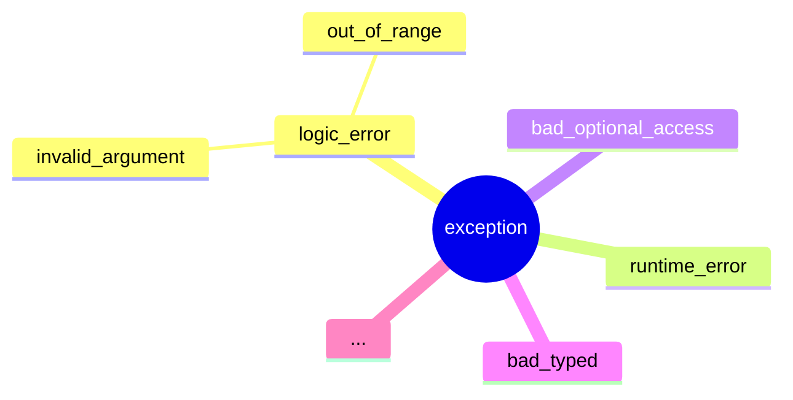

# Exceptions and the Exception Hierarchy

- Exceptions
    - Objects representing a response to an event
    - Help us make programs more robust and fault-tolerant
        - We can make programs fail / shut down in a predictable and/or graceful manner
        - Or can handle exceptions and have the program continue working
    - Exception objects are created from classes, like any objects
        - Three primary principles of OOP: encapsulation, inheritance, and polymorphism
            - We've already spent time on encapsulation (data hiding)
            - Inheritance relates to the relationship between classes
                - Inherited classes are "derived" classes
                    - Example, a "tank" could be derived from an "armored vehicle" class, which itself could be derived from a "vehicle" class
            - We'll look at inheritance and polymorhpism in more detail later, but
            inheritance is necessary to understand exceptions
- The Exception Hierarchy

Part of it, at least:

